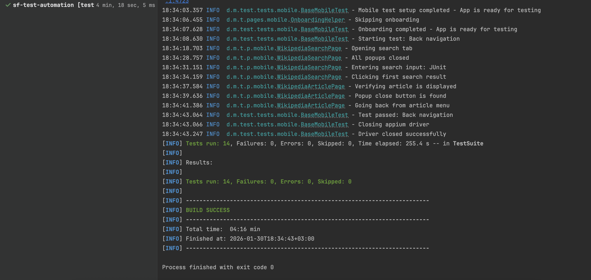

# Автоматизированные тесты для веб и мобильного приложения Wikipedia

## Описание проекта

Проект содержит автоматизированные тесты для:

- **Веб-сайта** en.wikipedia.org (9 тестов) ✅
- **Мобильного приложения** Wikipedia Android (4 теста) ✅

## Технологии

### Веб-тестирование:
- **Java 21**
- **Selenium WebDriver 4.16.1**
- **TestNG 7.8.0**
- **Maven 3.x**
- **WebDriverManager 6.1.0** (автоматическое управление драйверами)
- **SLF4J 2.0.9 + Logback 1.4.14** (логирование)

### Мобильное тестирование:
- **Appium Java Client 9.0.0**
- **UiAutomator2** (Android automation engine)
- **Android SDK** + **Эмулятор/Устройство**

## Требования

### Для веб-тестов:

1. Установить **Java 21+**
   ```bash
   java -version
   ```

2. Установить **Maven 3.6+**
   ```bash
   mvn -version
   ```

3. Установить **Firefox** (рекомендуется) или **Safari**

### Для мобильных тестов:

1. Установить **Node.js** и **npm**
   ```bash
   brew install node
   ```

2. Установить **Appium 2.x**
   ```bash
   npm install -g appium
   appium driver install uiautomator2
   ```

3. Установить **Android Studio** и эмулятор
4. Установить Wikipedia APK на эмулятор/устройство

## Структура проекта

```
SF-Test-course-project/
├── pom.xml                                    # Maven конфигурация
├── README.md                                  # Этот файл
│
├── src/test/
│   ├── java/dev/molkov/test/
│   │   ├── config/
│   │   │   └── BaseConfig.java              # Загрузчик конфигурации
│   │   │
│   │   ├── pages/
│   │   │   ├── web/                         # Page Objects для Веба
│   │   │   │   ├── BasePage.java
│   │   │   │   ├── WikiHomePage.java
│   │   │   │   └── WikiArticlePage.java
│   │   │   │
│   │   │   └── mobile/                      # Page Objects для Мобилки
│   │   │       ├── BaseMobilePage.java
│   │   │       ├── WikipediaSearchPage.java
│   │   │       ├── WikipediaArticlePage.java
│   │   │       └── OnboardingHelper.java
│   │   │
│   │   ├── tests/
│   │   │   ├── web/                         # Веб тесты
│   │   │   │   ├── BaseWebTest.java
│   │   │   │   └── WikipediaWebTests.java
│   │   │   │
│   │   │   └── mobile/                      # Мобильные тесты
│   │   │       ├── BaseMobileTest.java
│   │   │       └── WikipediaMobileTests.java
│   │   │
│   │   └── utils/
│   │       ├── WebDriverFactory.java        # Фабрика WebDriver
│   │       └── AppiumDriverFactory.java     # Фабрика AppiumDriver
│   │
│   └── resources/
│       ├── config.properties                # Конфигурация тестов
│       ├── testng.xml                       # TestNG suite (веб)
│       └── testng-mobile.xml                # TestNG suite (мобилки)
```

## Запуск тестов

### 🌍 Часть 1: Веб-тестирование

#### Список тестов (9 сценариев):

**Smoke тесты (критичные):**
1. ✅ `testMainPageLoadsSuccessfully` - Проверка загрузки главной страницы
2. ✅ `testSearchFunctionality` - Проверка базового поиска

**Regression тесты (расширенные):**
3. ✅ `testSearchWithMultipleQueries` - Параметризованный поиск (3 запроса)
4. ✅ `testRandomArticleNavigation` - Навигация к случайной статье
5. ✅ `testArticleStructureAndElements` - Проверка структуры статьи
6. ✅ `testFeaturedContentOnMainPage` - Проверка контента главной страницы
7. ✅ `testArticleReferencesSection` - Проверка раздела ссылок


#### Команды запуска:

```bash
# Запуск всех веб-тестов
mvn clean test

# Запуск только smoke-тестов
mvn test -Dgroups=smoke

# Запуск конкретного теста
mvn test -Dtest=WikipediaWebTests#testSearchFunctionality
```

---

### 📱 Часть 2: Мобильное тестирование

#### Список тестов (4 сценария):

**Smoke тесты (критичные):**
1. ✅ `testMainScreenDisplayed` - Проверка отображения главного экрана и контейнера поиска
2. ✅ `testSearchForSelenium` - Проверка поиска статьи "Selenium" и выдачи результатов
3. ✅ `testOpenJavaArticle` - Проверка поиска, открытия статьи "Java" и валидации заголовка (с обработкой онбординга)

**Regression тесты (расширенные):**
4. ✅ `testClearSearch` - Проверка функционала очистки поискового запроса

#### Необходимые условия:

1. **Запущен Appium Server**: `appium`
2. **Запущен Android Эмулятор**
3. **Установлено приложение Wikipedia** (`org.wikipedia`)

#### Команды запуска:

```bash
# Запуск всех мобильных тестов
mvn test -DsuiteXmlFile=src/test/resources/testng-mobile.xml

# Запуск только smoke-тестов
mvn test -DsuiteXmlFile=src/test/resources/testng-mobile.xml -Dgroups=smoke

# Запуск конкретного теста (например, проверка открытия статьи)
mvn test -DsuiteXmlFile=src/test/resources/testng-mobile.xml -Dtest=WikipediaMobileTests#testOpenJavaArticle
```

## Скриншот результатов всех тестов


---

## Особенности реализации

### ✨ Профессиональные паттерны:

1. **Page Object Model (POM)**
   - Четкое разделение логики страниц и тестов
   - Переиспользуемые компоненты (например, `OnboardingHelper` для мобилок)

2. **Обработка онбординга (Mobile)**
   - Автоматическое определение и закрытие приветственных экранов
   - Умная обработка всплывающих окон внутри тестов (например, при первом открытии статьи)

3. **Стабильность (Mobile)**
   - Использование `accessibility id` и `UiAutomator2`
   - Явные ожидания (`WebDriverWait`) для асинхронных событий
   - Предварительные клики для фокуса на полях ввода (Appium specific)

4. **Кросс-платформенность**
   - Единая кодовая база для конфигурации
   - Разделение фабрик драйверов (`WebDriverFactory` vs `AppiumDriverFactory`)

## Конфигурация

Файл `src/test/resources/config.properties`:

```properties
# Веб-тестирование
web.base.url=https://en.wikipedia.org
web.browser=firefox
web.headless=false
web.implicit.wait=10
web.explicit.wait=15
web.page.load.timeout=30

# Мобильное тестирование
mobile.platform.name=Android
mobile.device.name=Android Emulator
mobile.automation.name=UiAutomator2
mobile.app.package=org.wikipedia
mobile.app.activity=org.wikipedia.main.MainActivity
mobile.appium.server.url=http://127.0.0.1:4723/
```

## Отчеты

После выполнения тестов отчеты доступны в:
- `target/surefire-reports/index.html`
- `target/surefire-reports/emailable-report.html`

## Автор

Олег Молков
Проект: SF Test Automation Course
